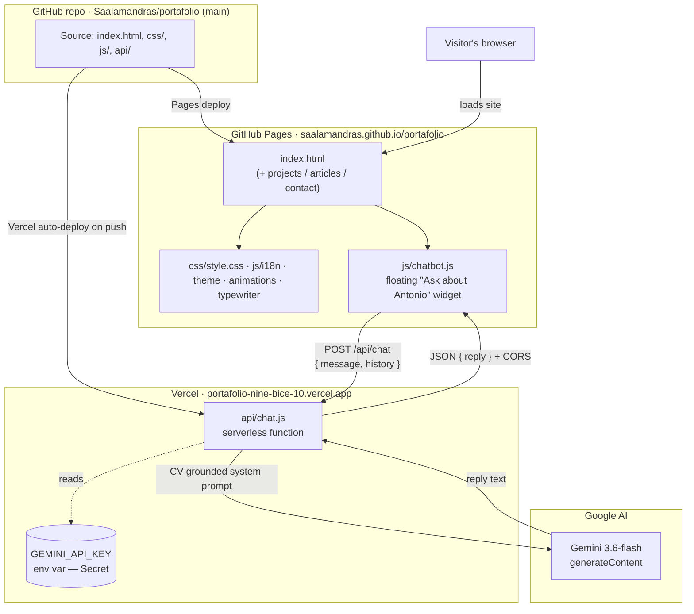

# Portfolio Chatbot — Roadmap

An AI chatbot on the portfolio site that answers questions about Antonio's
professional background, grounded in his resume.

## ✅ Status: LIVE

The chatbot is deployed and verified answering correctly (EN + IT tested) from the
production endpoint on `2026-09-13`. All four milestones are complete.

## Architecture (decided)

- **Frontend:** GitHub Pages (`https://saalamandras.github.io/portafolio/`),
  plain HTML/CSS/vanilla JS — no framework, no build step.
- **Backend:** a single Vercel serverless function (`api/chat.js`) in this same repo,
  deployed to Vercel alongside GitHub Pages. Holds the API key, calls the LLM.
- **LLM:** Google Gemini (`gemini-3.6-flash`), free tier.
- **Database:** none — chat history kept in a JS array in the browser (add later if wanted).
- **Cross-origin:** page is on `github.io`, function on `vercel.app`, so the function
  sends CORS headers allowing the Pages origin.
- **Security model:** API key only in Vercel env vars (never in code); no tools/actions;
  caps in place — rate limit, input length limit, `maxOutputTokens`.

### System diagram

## Key URLs

- Repo: `https://github.com/Saalamandras/portafolio.git` (branch: `main`)
- Stable API endpoint: `https://portafolio-nine-bice-10.vercel.app/api/chat`
- Live site: `https://saalamandras.github.io/portafolio/`

## Milestones

### ✅ Milestone 1 — Working endpoint (echo)
- Created `api/chat.js` (correct `api/` folder structure for Vercel).
- Handler: CORS headers, OPTIONS preflight, POST-only, body validation, JSON echo.
- Deployed to Vercel; disabled Vercel Authentication (Deployment Protection) so the
  endpoint is publicly reachable.

### ✅ Milestone 2 — Real Gemini call
- Handler is `async`; echo replaced with a `fetch()` to Gemini
  (`v1beta/models/gemini-3.6-flash:generateContent`).
- Reads reply from `data.candidates[0].content.parts[0].text`, returns `{ reply }`.
- Gemini call wrapped in try/catch → clean 5xx on failure; handles non-OK responses
  and empty/safety-blocked candidates.
- Note: `gemini-1.5-flash` and `gemini-2.0-flash` were both retired by Google; the
  live model is `gemini-3.6-flash` (the API's 404 body reports the current successor).

### ✅ Milestone 3 — Resume context + hardening
- System prompt (`systemInstruction`) grounds answers in Antonio's CV (synthesised
  from all four CV PDFs): identity, skills, projects, experience, languages, plus
  guardrails (stay on-topic, no invented facts, answer in the visitor's language).
- Security caps: input length limit (2000 chars), `maxOutputTokens` (700), basic
  per-IP rate limiting (15/min — in-memory, best-effort).

### ✅ Milestone 4 — Chat widget
- `js/chatbot.js` — self-contained floating widget. Injects its own styles (using the
  site's CSS variables, so it themes with dark/light automatically) and DOM.
- `fetch()`es the stable Vercel endpoint; keeps history in a JS array and sends prior
  turns for multi-turn context.
- UI labels follow the site language (EN/ES/IT/PT) and update on `i18n:applied`.
- Wired into `index.html` (`<script src="js/chatbot.js">` before `</body>`).
- Verified live against the production endpoint: correct grounded answers in EN and IT.

## Deployment steps (done — reference for next time)
1. `GEMINI_API_KEY` set in Vercel → Environments → Production (Secret type). ✅
2. Push to `main` → Vercel auto-deploys `api/chat.js`; GitHub Pages serves the
   updated `index.html` + `js/chatbot.js`. ✅
3. Env-var or model changes require a new deployment (a push, or Redeploy in Vercel).

## Follow-ups / backlog
- [ ] **Add the widget to the other pages** (`projects.html`, `articles.html`,
      `contact.html`) — same one-line `<script src="js/chatbot.js">` include before
      `</body>`. Home page (`index.html`) already has it.
- [ ] **Decide on the 4 untracked CV PDFs** — either `git add` them, or add them to a
      `.gitignore` (e.g. `*.pdf` at repo root) to keep them local only.
- [ ] Optional: raise/lower `MAX_OUTPUT_TOKENS` in `api/chat.js` to tune reply length.
- [ ] Optional: persist chat history (currently resets on page reload — by design).
- [ ] Later: migrate frontend fully to Vercel (optional; keeping Pages URL stable for now).
